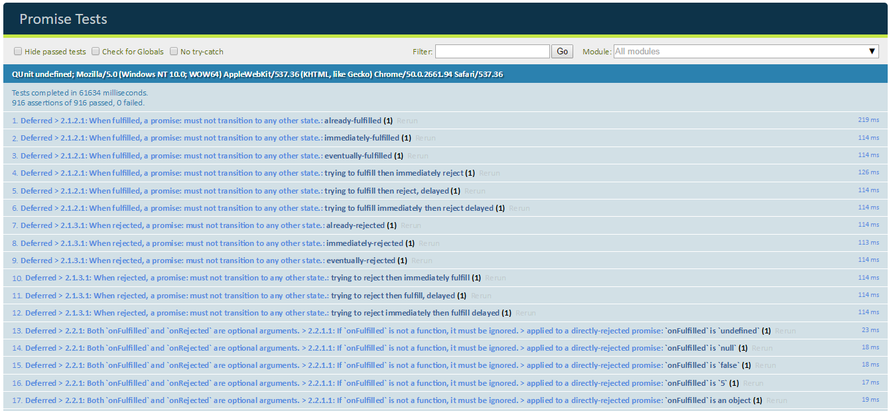

1. Run `npm install`. Installs `browserify` and `promises-aplus-tests`.

2. Run `npm run buildPromiseTests`. Same as running `browserify ./test.js -o ./promise-tests-browser.js`.

3. Open `index.html`. All the tests of the Promises/A+ specification will run using QUnit.

[Demo](http://jdmota.github.io/promise-tests-browser/)

